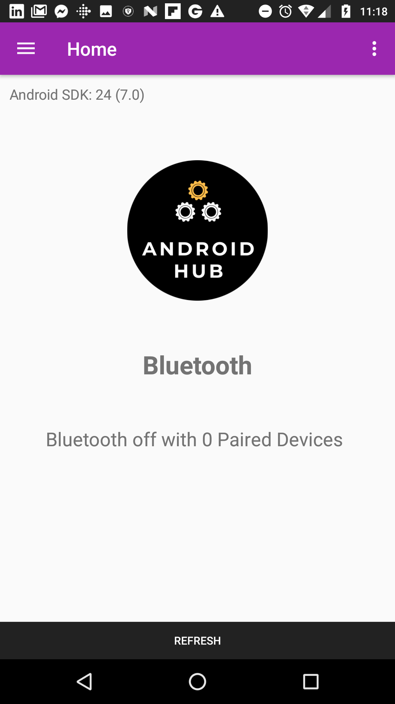
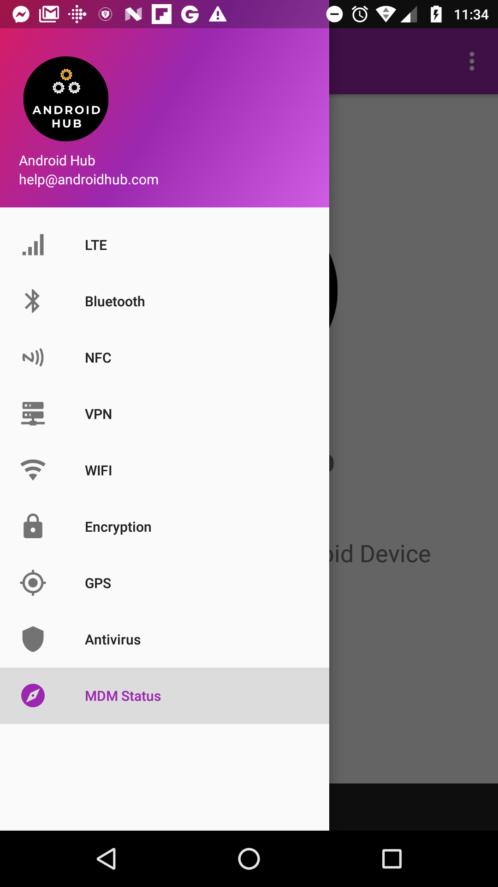
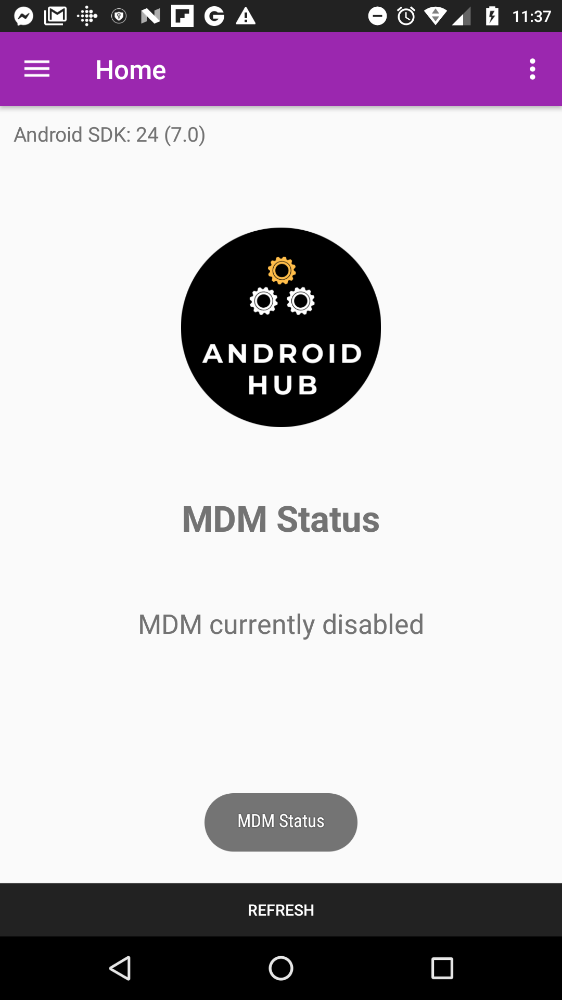

    

# AndroidHub

## Running the app
* Install android studio
* Clone this project and open source
* Install emulator or connect device with Android lollipop or higher
* Connect device to android studio via usb or emulator.
* Run app from android studio

## Screenshots

    

    

p align='center'>
    

